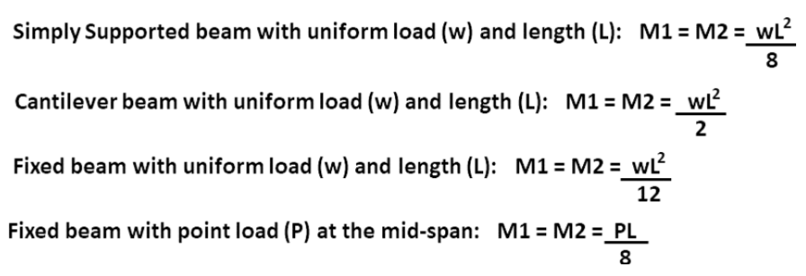

### Theory

The slope deflection method is a classical displacement-based structural analysis technique used to determine the displacements and member end forces for a beam/ frame subjected to external loads. The method is computationally prefered over force method for structures for which DSI > DKI, where DSI is degree of static indeterminacy and DKI is the degree of kinematic indeterminacy. 

<strong>1. Assumptions:</strong>   
•	The beam is made of a linearly – elastic material (Hooke’s law is valid). 
•	The beam undergoes small deformations, and its geometry remains unchanged.  
•	The cross-sections of the beam remain plane and perpendicular to the longitudinal axis.  
•	The loads applied the beam are static (do not vary with time).   

<strong>2. Structural Idealization: </strong>  
•	The beam is discretized into individual members (segments) between consecutive supports and points of loading.  
•	Each member is onsides as a simple beam with three degrees of freedom: two rotations(ƟA and ƟB) and relative displacement (δ = δA - δB).  

<strong>3. Sign Conventions</strong> 
•	Anticlockwise rotations and moments are considered as positive(+ve). 
•	Relative displacement δA is considered positive, if it leads to anticlockwise rigid body rotations i.e δA > δB  

<strong>4. Determination of Fixed Moments (FEM):</strong>  
•	The first step is to determine the fixed end moments for each member, which represent the moments that would develop at the ends of the member if it were fully fixed (rotationally and translationally) and subjected to the applied loads.  
•	For each member, the fixed end moments are computed using the known loads and the geometry of the beam, taking into account the support conditions at the ends, using well-known standard formulas.  

 

 

<strong>The next step is the formation of slope-deflection equations:</strong>  
•	The slope-deflection equations relates the rotation (Ɵ) and the relative vertical displacement (δ) with the bending moments at the ends. 
•	These equations are derived based on the relationship between bending moment, rotations, and the material properties of the beam (Elastic Modulus and Moment of Inertia), as follows.  
 

 
where: MFAB and MFBA = Fixed ended moments, ƟA and ƟB = Beam end rotations, δAB = δB - δA = Relative vertical displacement between end A and B. 
•	ƟA and ƟB - anticlockwise (+ve). 
•	δAB - Considered positive if member rotates anticlockwise as a whole.  

<strong>5. Application of equiliberium Equations:</strong>  
•	Moment equilibrium are applied to form equations, whose solution leads to obtaining the unknown displacements. For example at joint B, (MBA + MBC = MB = 0) . After displacements and rotation are obtained, the members and moments obtained using the slope deflection equations (1 & 2). 

<strong>6. Verification of Results:</strong>  
•	The computed bending moments and rotations should satisfy the equilibrium conditions at each joint and for the entire structure. 
 