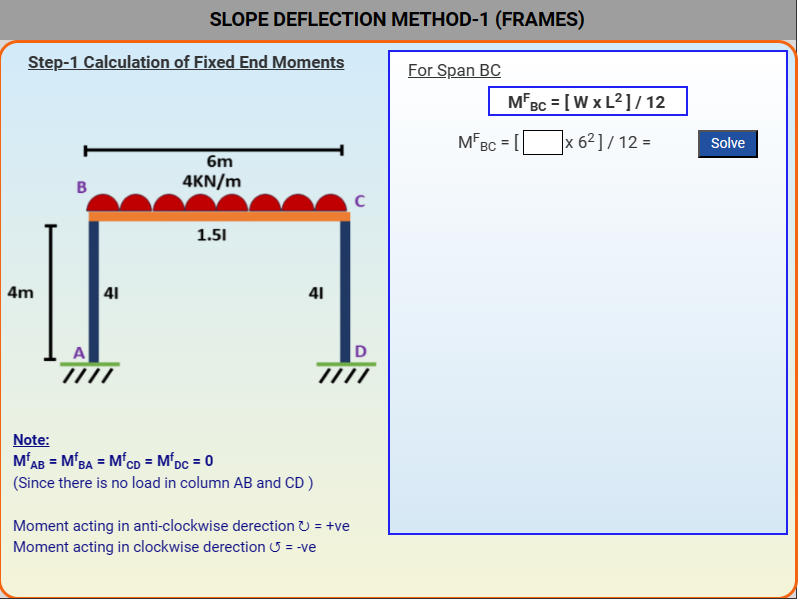
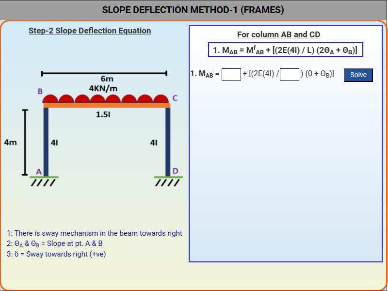
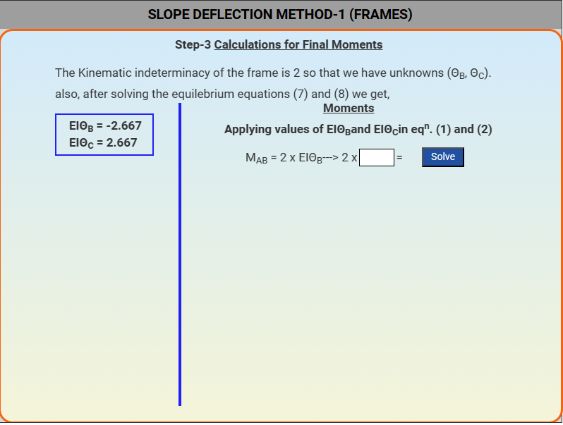
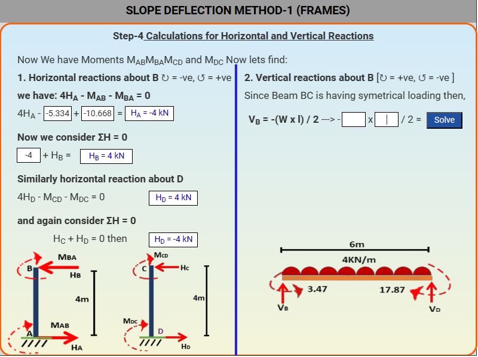
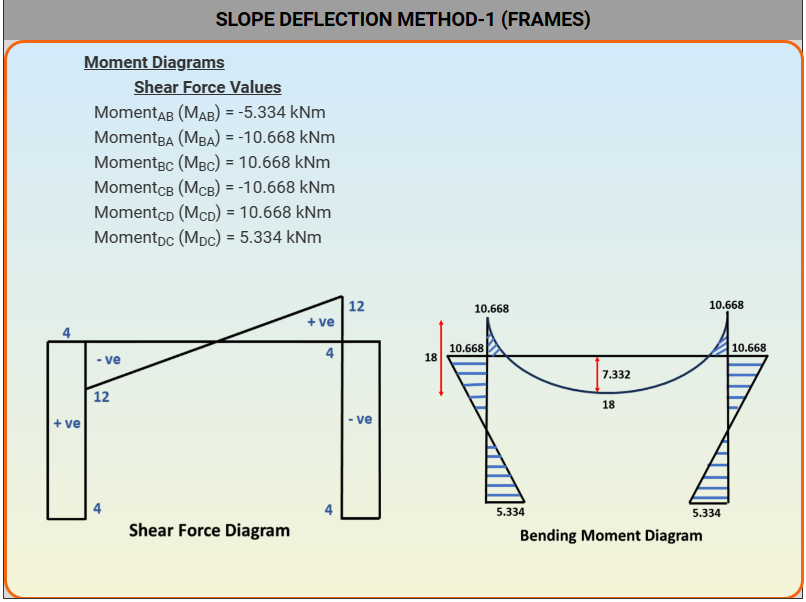

### These steps will be followed for the experiment

1. Click on start experiment button to start the experiment.

(a) Click on 'start' button to start analysis.

Step-1: Calculation of fixed end moments.

Step-2: Calculation of slope deflections equations.

Step-3: Calculation of final moments.

Step-4: Calculation for horizontal and vertical reactions.

Step-5: Shear force diagram.

Step-6: Bending moment diagram.

